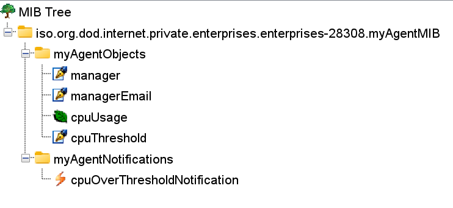
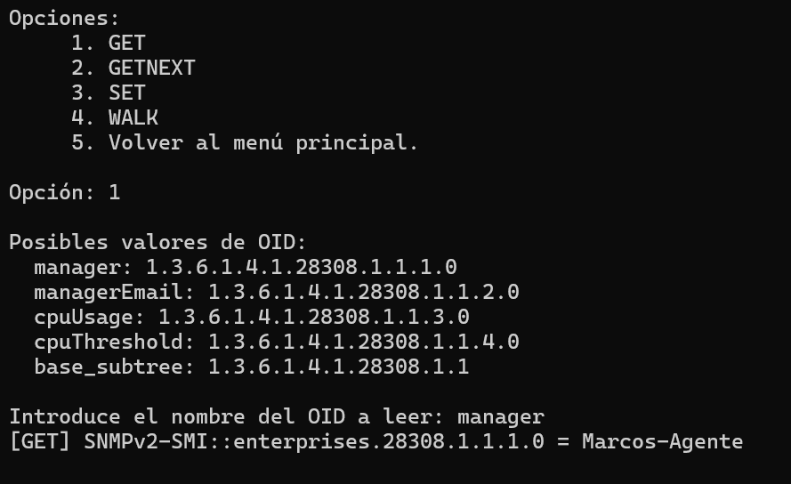
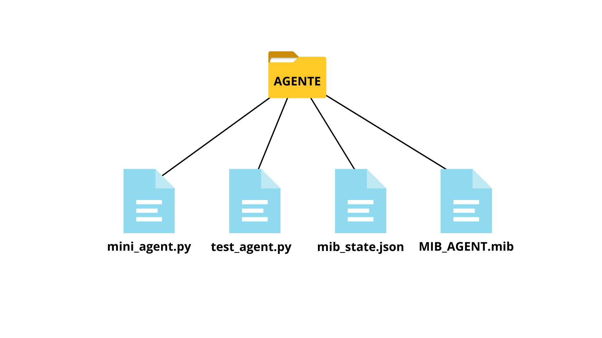

# Mini SNMP Agent with Notifications

<p align="center">
  
</p>

> Este proyecto es un agente SNMP que monitoriza la CPU y resuelve la necesidad de enviar alertas proactivas (TRAP y email) cuando ésta supera un umbral, en lugar de requerir un sondeo manual.

---

## 🌟 Las principales características del proyecto son:

* MIB personalizada para gestionar la CPU (MIB_AGENT.mib).
* Soporte para operaciones SNMP (GET, GETNEXT, WALK, SET).
* Monitorización activa de la CPU.
* Sistema de alertas doble (Trap y Email).
* Persistencia de datos (mib_state.json).

---

## 📁 Archivos necesarios:

* **MIB_AGENT.mib** Este archivo define el agente. En él se establecen los OIDs que existen, qué tipo de datos manejan y qué notificaciones se pueden mandar. 

<p align="center">
  
</p>

_MIB_AGENT.mib compilado en MIB Browser._

* **mib_state.json** Este archivo es la base de datos del agente. Almacena el valor actual de los objetos definidos en la mib. Cuando el agente se reincia, este archivo le permite recordar los valores que había configurado.

* **mini_agent.py** Este es el programa principal que se ejecuta. Actúa como un servidor que se queda escuchando peticiones SNMP (GET, SET, GETNEXT) en el puerto 161. También inicia el monitor de CPU y es responsable de enviar las alertas (TRAP y email) cuando el umbral se supera.

* **test_agent.py** Este es un programa separado que actúa como un "cliente" o "manager" de red. Su único propósito es probar que el mini_agent.py funciona. Envía peticiones SNMP (GET, SET) al agente y comprueba que las respuestas sean correctas, simulando ser una herramienta de gestión de red.

<p align="center">
  
</p>

_Ejemplo ejecución test_agent.py._

---

## 🚀 Cómo probarlo

Sigue estos pasos para tener una copia local del proyecto funcionando.

### 1. Prerrequisitos

* Python 3.10+ (https://www.python.org/)
* Pysnmp 7.1.4 (https://pypi.org/project/pysnmp/7.1.4/)

### 2. Entorno de ejecución

Para lanzar el agente, tienes que tener un directorio con los siguientes archivos (MIB_AGENT.mib no es necesario, solo para visualizarlo en un MIB Browser):

<p align="center">
  
</p>

### 3. Ejecución

1.  Instalar librería pysnmp:
    ```bash
    pip install pysnmp==7.1.4
    ```
2.  Navega al directorio del proyecto:
    ```bash
    cd mini-agent
    ```
3.  Inicia el mini_agent:
    ```bash
    python mini_agent.py
    ```
4.  Inicia el administrador/tester:
    ```bash
    python test_agent.py
    ```


